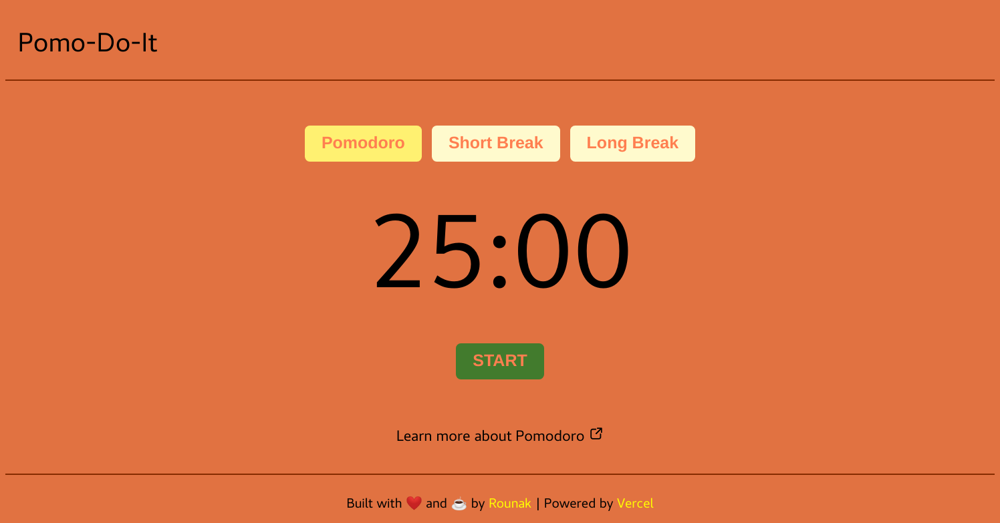

# Pomo-Do-It: Your Online Pomodoro Timer

[Pomo-Do-It](https://pomo-do-it.vercel.app/) implements the Pomodoro technique. Pomodoro technique is a time management method that uses a timer to break 
down work into intervals, traditionally 25 minutes in length, separated by short breaks. Each interval is known as a 
pomodoro, from the Italian word for 'tomato'. After four pomodoros, one can take a longer break (15–30 minutes).



Pomo-Do-It was submitted as an entry for the [Hashnode](https://hashnode.com/) Hackathon powered by [Vercel](https://vercel.com/).

## Developing Pomo-Do-It locally

First, run the development server:

```bash
npm run dev
# or
yarn dev
```

Open [http://localhost:3000](http://localhost:3000) with your browser to see the result.

## Deployed on Vercel

[Pomo-Do-It](https://pomo-do-it.vercel.app/) is deployed using the [Vercel Platform](https://vercel.com/new)
from the creators of Next.js.

Check out [Next.js deployment documentation](https://nextjs.org/docs/deployment) for more details.
